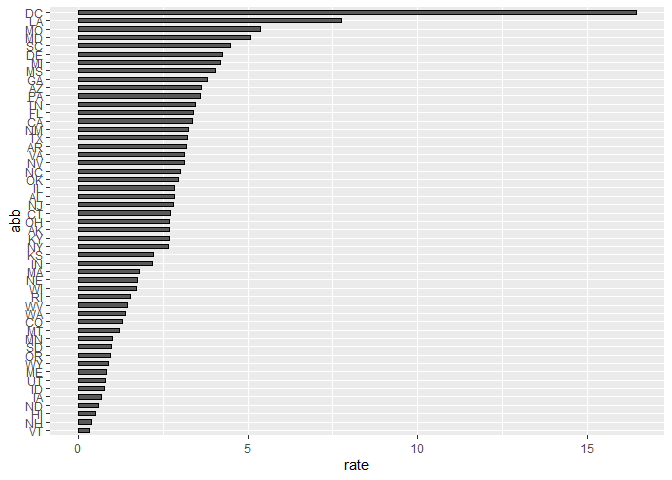

Report on Gun Murders
================
Nguyen Minh Tri
10/11/2019

## Introduction

This is a report on 2010 gun murder rates obtained from FBI reports. The
original data was obtained from [this Wikipedia
page](https://en.wikipedia.org/wiki/Murder_in_the_United_States_by_state).

We are going to use the following library:

``` r
library(tidyverse)
```

and load the data we already wrangled:

``` r
load("rda/murders.rda")
```

## Murder rate by state

We note the large state to state variability by generating a barplot
showing the murder rate by state:
<!-- -->

<!-- ## Including Plots -->

<!-- You can also embed plots, for example: -->

<!-- ```{r pressure, echo=FALSE} -->

<!-- plot(pressure) -->

<!-- ``` -->

<!-- Note that the `echo = FALSE` parameter was added to the code chunk to prevent printing of the R code that generated the plot. -->
